# Meta-Learning and Differentiable Convex Optimization with `Flux` and `Zygote`

<br/>
<br/>
<div style="font-size: 30px; ">
by [`Dboy Liao`](https://github.com/dboyliao)
</div>

slides: [https://dboyliao.github.io/ConvOptDL.jl](https://dboyliao.github.io/ConvOptDL.jl)

---

## About Me

- My real name is Yin-Chen Liao but all my friends call me Dboy
    - [GitHub](https://github.com/dboyliao)
    - [Linkedin](https://www.linkedin.com/in/yin-chen-liao-69967188/)
- Core Developer of [`uTensor`](https://utensor.github.io/website/) project
    - Author of [`utensor_cgen`](https://github.com/uTensor/utensor_cgen), code generator for `uTensor`
    - Contributor to `uTensor` C++ runtime

---

## About Me

- Interested in
    - Scientific Computing
    - Optimization
    - Machine Learning & Deep Learning
- Freelancer
    - Got a bunch of time **hacking**
--

<div style="margin-left: 60px; font-size: 32px;">
That's why I'm here!
</div>

---

## About The Talk

- My one month challenge
    - Try to reproduce a deep learining paper with Julia
    - Writing my very first Julia package
    - IN ONE MONTH

---

## Agenda

- [Meta Deep Learning](#meta-deep-learning)
  - [MetaOptNet](#meta-opt-net)
- [Wait! SVM in Loss Function?](#conv-opt-meta)
- [Implementation](#impl)
- [Learning and Afterthoughts](#why-im-fucked)

---

## The Repo

If you want to look at the code by yourself, you can find it over [ConvOptDL.jl](https://github.com/dboyliao/ConvOptDL.jl)

- Download the training/testing/valiation dataset over [here](https://drive.google.com/file/d/1Vd7br_DJGlaUEbKL0xLNXC0tAx9VuP2W/view?usp=sharing)

--

Let's get started!

---

name: meta-deep-learning
## Meta Deep Learning

- Human are extremely efficient at learning
    - we can learn from small data
- Can we do that in deep learning?
    - can we make deep learning model to learn how to learn?

---

<blockquote cite="https://arxiv.org/pdf/1606.04080v2.pdf" style="padding-top: 10em; padding-bottom: 5em;">
    <p>
    our training procedure is based on a simple machine learning principle: <strong>test and train conditions must match</strong> 
    </p>
    <p>-- Vinyals et al., Matching Networks for One-Shot Learning</p>
</blockquote>

---

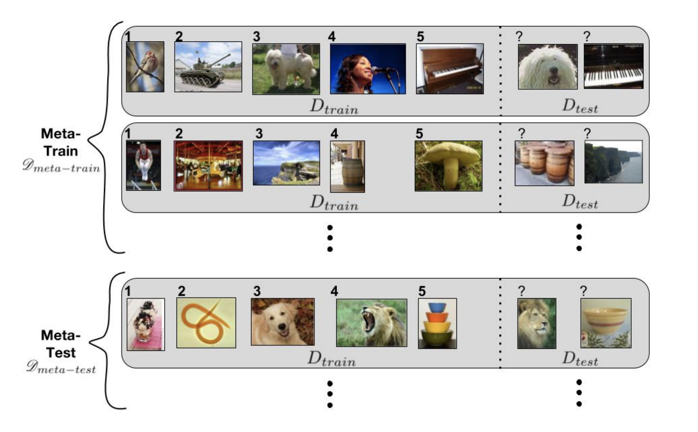

[Ravi & Larochelle ‘17](https://openreview.net/pdf?id=rJY0-Kcll)

---

## Meta Training

Given:
- A meta learner $f_{\phi}$
- A base learner $g_{\theta}$

Do:
1. Draw $({}\_iD\_{train}^{meta\-train}, {}\_iD^{meta\-train}\_{test}) \in \mathcal{D}^{meta\-train}$
2. Finding the optimal $\theta^*$ value for base learner with loss $\mathcal{L}(\theta; \phi, {}\_iD_{train}^{meta-train})$
3. Compute meta loass, $\mathcal{L}^{meta}(\phi, \theta^*(\phi); {}\_iD^{meta-train}_{test})$
4. Update $\phi$:  $\phi \leftarrow \phi - \eta \triangledown\_{\phi}\mathcal{L}^{meta}(\phi, \theta^*(\phi); {}\_iD^\{meta-train\}_{test})$

---

## Basic Meta Learning Pattern

```julia
ϕ = parameters(model)
meta_opt = ADAM(lr)
for tasks in tasks_sampler # the outer-loop
    support_set = tasks.support_set
    query_set = tasks.query_set
    θ = θo # initial value
    for samples in support_set # the inner loop
        # trainig a base model, minimize trainig loss ...etc
        θ = upate_theta(samples, model, θ)
    end
    update!(meta_opt, meta_loss, ϕ) # update parameters with meta_loss
end
```

---

name: meta-opt-net
### MetaOptNet

As an example, I implement [MetaOptNet](https://github.com/kjunelee/MetaOptNet)

- A good example of meta supervised learning fused with convex optimization
- **learning an embedding network** which gives good representations such that the resulting SVM performs well

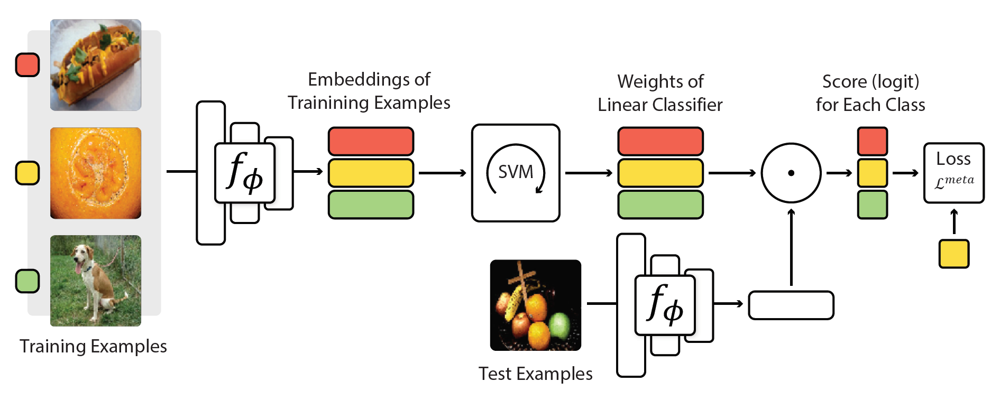

[MetaOptNet](https://github.com/kjunelee/MetaOptNet)

---

## Fast Quiz

- What is the meta learner in `MetaOptNet`?
- What is the base learner then?

```julia
ϕ = parameters(model)
meta_opt = ADAM(lr)
for tasks in tasks_sampler # the outer-loop
    support_set = tasks.support_set
    query_set = tasks.query_set
    θ = θo # initial value
    for samples in support_set # the inner loop
        # trainig a base model, minimize trainig loss ...etc
        θ = upate_theta(samples, model, θ)
    end
    update!(meta_opt, meta_loss, ϕ) # update parameters with meta_loss
end
```

--- 

name: conv-opt-meta
## Wait! SVM in Loss Function?

- SVM can be formulated as following quadratic programming problem (QP)
$\min\_{\theta\_k, \xi\_n}\frac{1}{2} \sum\_k\lVert \theta\_k \rVert^2 + C \sum\_n\xi\_n$
$\xi\_n \geq 0, \forall n$
$\theta\_{y\_n} \cdot f\_{\phi}(x\_n) - \theta\_k\cdot f\_{\phi}(x\_n) \geq 1 - \delta\_{y\_n, k} - \xi\_{n}, \forall n, k$

- Let's say we solve it with a solver, $\text{QPSolver}(\cdot)$
- That is, $\theta^* = \text{QPSolver}(f\_{\phi}(x))$
- So we have $\mathcal{L}^{meta}(\phi, \theta^*; D^{meta\-train}\_{test}) = \mathcal{L}^{meta}(\phi, \text{QPSolver}(f\_{\phi}); D^{meta\-train}\_{test})$

--

<div style="margin-left: 70px; font-size: 32px;">
All we need is $\triangledown_{\phi}\mathcal{L}^{meta}$!
</div>

---

- That is, $\triangledown\_{\phi}\mathcal{L}^{meta} = \frac{\partial}{\partial \phi}\mathcal{L}^{meta} + \frac{\partial}{\partial\theta}\mathcal{L}^{meta}\cdot$<span style="color: red;">$\frac{d}{d\phi}\text{QPSolver}$</span>

--

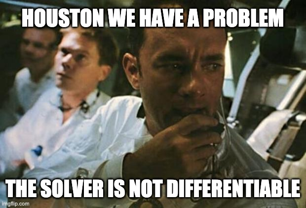


---

## Math is All You Need

- Short story: the solver is in fact differentiable
--
- Long story: with **strong duality**, **KKT conditions** and **implicit function theorem**, we can analytically compute the gradient as following

<div style="float: right;">
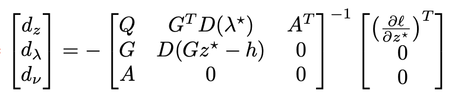
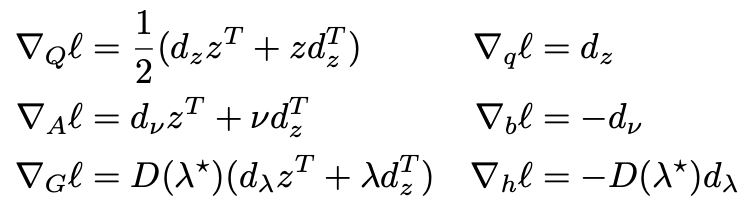
</div>

--

- For those who are big fan of math, please refer to [Amos & Kolter 2019](https://arxiv.org/abs/1703.00443) and [Shane 2019](https://arxiv.org/abs/1804.05098) for detail
- Or my blog [post](https://medium.com/@dboyliao/differentiable-deep-learning-layer-for-convex-optimization-545dc7a65c)

---

name: impl
## Implementation

1. Data preprocessing, reformat normal dataset as $\mathcal{D}^{meta\-train} = \\{(D^{meta\-train}\_{train}, D^{meta\-train}\_{test})\\}$
2. Differentiable $\text{QPSolver}$ (with `Zygote.@adjoint`)
3. The embedding network, $f\_{\phi}$
4. The inner/outer training loop

--

<div style="width: 300px; margin-top: -100px; margin-left: 500px;">

</div>

---

## Data Preprocessing

- [`data_loader.jl`](https://github.com/dboyliao/ConvOptDL.jl/blob/master/src/data_loader.jl)
- Extending `sample` from `StatsBase`
- **Multiple dispatching** make it really easy to extend existing library

<div>
<span style="margin-right: 100px;">
</span>
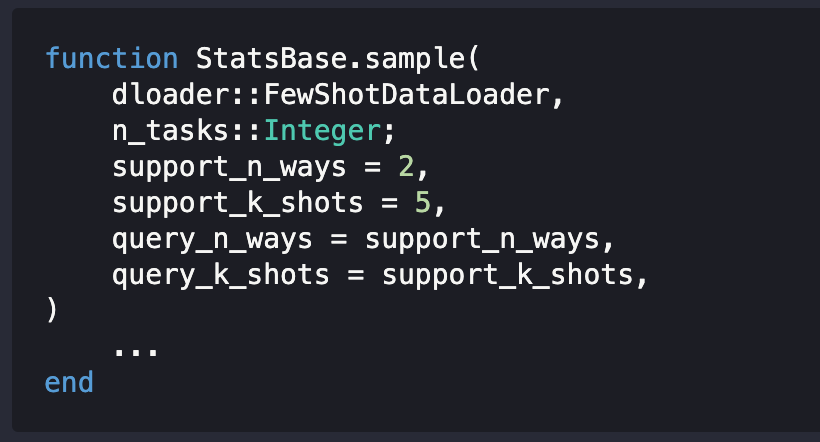
</div>

---

## Differntiable QP Solver

- [`qp.jl`](https://github.com/dboyliao/ConvOptDL.jl/blob/master/src/qp.jl)
- Solve the QP with `Convex.jl`, which has nice API and comply to `MathOptInterface`
- Define backward gradient with `Zygote.@adjoint` even the solver itself is not differentiable
- Just like `torch.nn.Module.backward`

<div style="width: 800px; padding-left: 100px;">
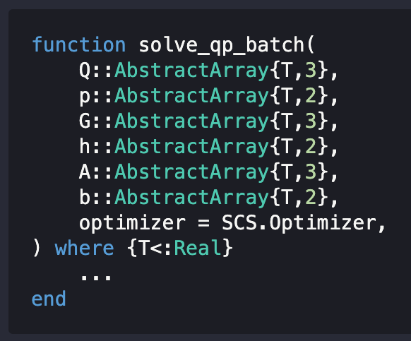
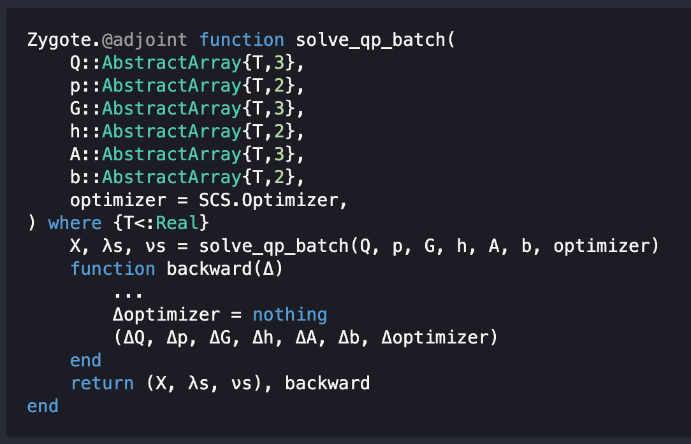
</div>

---

## The Embedding Neural Network

- Easy peacy, just use `Flux` layers

<div style="width: 800px; margin-left: 100px;">
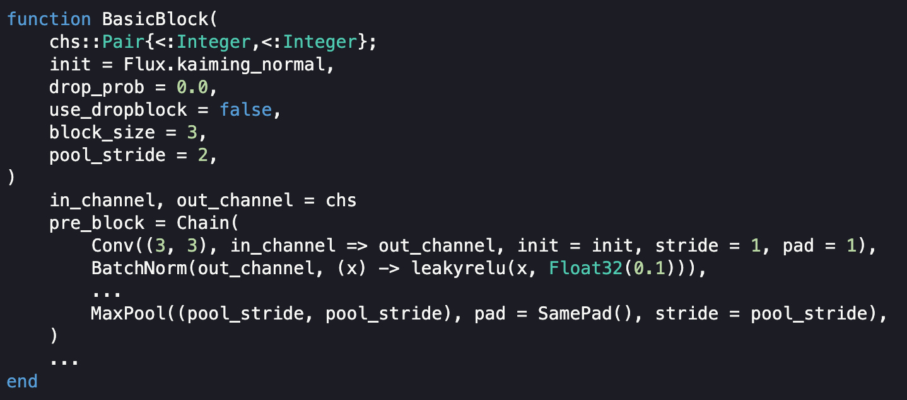
</div>

---

## Experiments

- Finally my training script is running

--

<div style="margin-left: 60px; font-size: 32px;">
But the model is not working ... (with simple <code class="remark-inline-code">SGD</code>)
</div>

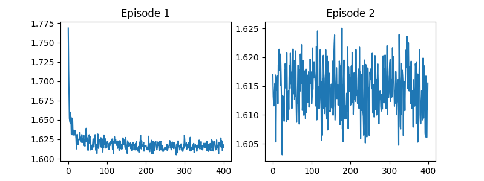

---

## Experiments

- Let's use `ADAM`!

--

Errr.....

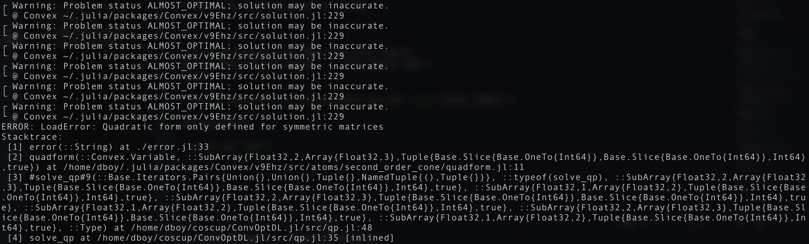

---

name: why-im-fucked
## Learning and Afterthoughts

- Implementaion differences between `Convex.jl` and `cvxpy`
- More gradient check for the $\text{QPSolver}$
- GPU support for batch QP solver and backward gradient function
- Check my custom `Flux` layer
- Some common utility functions are not yet supported in `Flux` and it took me more time than I expected in implementation
- Memory layout: row major $\rarr$ column major

---

## `Python` Ecosystem

<div style="margin-top: 100px; margin-left: 100px">

</div>

---

## `Julia` Ecosystem

<div style="margin-top: 100px;">
<div style="float: left; width: 450px;">
    
</div>
<div style="float: right; width: 500px;">
    <p>It's easy to integrate different libraries in <code style="font-size: 1rem;">Julia</code> because of common interfaces and shared data structures</p>
    <p>However, comparing with other machine learning community such as <code style="font-size: 1rem;">Python</code>, it's not matured and stable</p>
</div>
</div>
